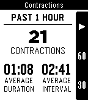

# Contractions

An open-source Pebble app for tracking pregnancy contractions.

Written with love for the author's wife and firstborn. Shared freely to the
world for the good of humanity.

## Installation

Download [Contractions][1] from Pebble appstore.

## Contributing

Feel free to contribute new features or bug fixes, and I will push those changes
to the Pebble appstore.

## License

Contractions is released under [MIT][2] license.

[1]: https://apps.getpebble.com/en_US/application/531d9a3714708baa95000189

[2]: https://github.com/jayjun/Contractions/blob/master/LICENSE.md
